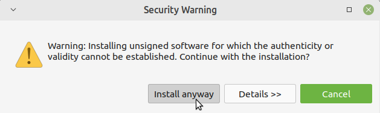

# Plugin Manual Install

Download the latest package (zip) at the [releases](https://github.com/Aimirim-STI/4diac-Plugin-UAORT/releases) page under the `Assets` section.

Go to the `Install New Software` menu:

On the "Install" window, click in `Add...` and then in `Archive...` on the "Add Repository" popup.

Choose the zip file downloaded from the release then and click in `Add`.

Then check the `Aimirim 4diac Plugins` group and click `Next`.

Accept the terms of the Eclipse License and click `Finish`.

If prompted to "Trust Signers" Mark all the checkboxes in the first table and click in `Trust Selected`

## Restart 4diac IDE so the changes can take effect.
